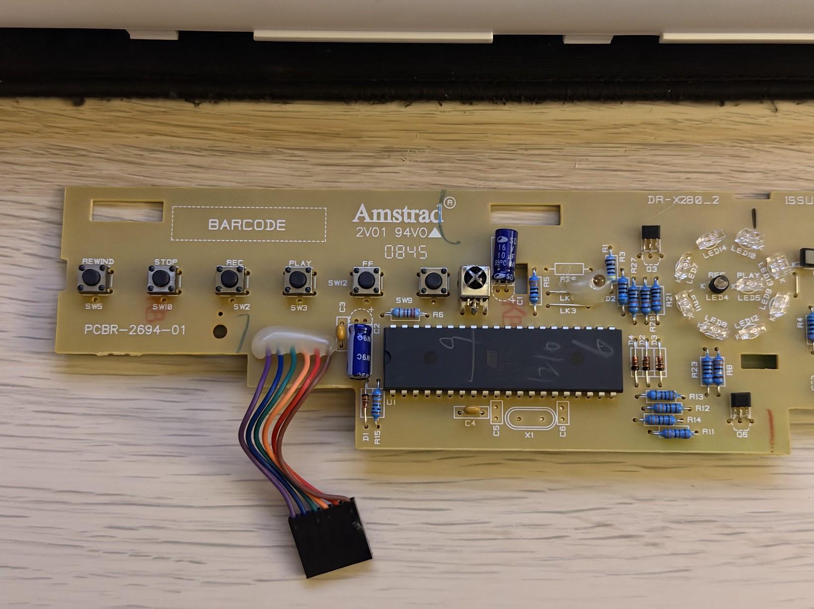

# Sky+ DRX280 front-panel reverse engineering

An evidence-led reverse-engineering archive for the Amstrad Sky+ DRX280 front panel.

The front panel contains an ATmega16L microcontroller that drives its indicators, scans the buttons and handles an external IR path. This repository documents the original firmware, the two-wire application bus, the six-wire harness, the LED engines, the button matrix and a Raspberry Pi Pico reference interface.

The material is intended to help someone reproduce or adapt the panel interface in their own project. It is not a drop-in wiring recipe: verify every rail, pull-up, connector position, board revision and Pico variant on the hardware being used.

## What is documented

- ATmega16L firmware structure, fuse/lock interpretation and memory map.
- I²C/TWI protocol, target address, register bank and transaction framing.
- Six status channels, their measured colours and PWM behavior.
- Eight-position ring animation engine and logical output mapping.
- 3×5 button matrix, public masks and measured button mapping.
- Six-wire harness continuity results and signal identification.
- Pico-side software-I²C reference implementation and diagnostic UF2 images.
- Original flash/EEPROM dumps, source snapshots, measurements and high-resolution board photographs.

## Verified panel identity

| Item | Result |
|---|---|
| Panel PCB | Amstrad DR-X280_2 / PCBR-2694-01, issue 3 |
| MCU | ATmega16L-8PU, 40-pin PDIP |
| Application bus | I²C/TWI target at seven-bit address `0x40` |
| Read framing | Write the register pointer, issue STOP, then start a separate addressed read |
| Flash dump | 16,322 bytes, supplied from the original MCU |
| EEPROM dump | 512 bytes, supplied from the original MCU; archived file is all `0x00` |

The original dumps are in [`02_firmware_artifacts/original_panel_dumps`](02_firmware_artifacts/original_panel_dumps). Their hashes are in [`MANIFEST_SHA256.md`](MANIFEST_SHA256.md).

## LED system

The firmware has two independent visual engines:

- Six status channels controlled by enable, blink and PWM fields.
- An eight-position ring generated as phase tables and rendered through shared multiplexed LED banks.

Measured status-channel mapping:

| Channel | Visible indicator |
|---:|---|
| 0 | Online, green |
| 1 | REC, red |
| 2 | PLAY, green |
| 3 | Message, yellow |
| 4 | Remote, red |
| 5 | PWR button green at brightness 7; with status outputs off, the normal standby indication is red |

The firmware-derived LED details are in [`peripherals.md`](01_existing_md/electrical_and_pinout/peripherals.md).

## Button system

The original firmware scans three driven columns and five sensed rows, then publishes a 15-bit public mask. The measured mapping is:

| Physical control | Public mask |
|---|---:|
| PWR / standby | `0x0080` |
| Record | `0x0040` |
| Play | `0x0020` |
| Info | `0x0010` |
| Rewind | `0x0008` |
| Select / centre | `0x0004` |
| D-pad left | `0x0002` |
| D-pad up | `0x0001` |
| Fast-forward | `0x0800` |
| Stop | `0x2000` |
| TV guide | `0x1000` |
| Pause | `0x4000` |
| Back up | `0x0400` |
| D-pad right | `0x0200` |
| D-pad down | `0x0100` |

The calibration record is [`BUTTON_MAPPING_CALIBRATION.md`](01_existing_md/panel_control/BUTTON_MAPPING_CALIBRATION.md).

## Pico reference interface

The validated panel-side signal roles are:

| Panel signal | Pico reference connection |
|---|---|
| Green harness wire / SCL | GP16 through a bidirectional level translator |
| Orange harness wire / SDA | GP17 through a bidirectional level translator |
| Purple and blue | Ground |
| Brown | Panel logic-supply rail; measure the actual board before choosing a supply |
| Red | External IR path; leave isolated until its use is independently verified |

Use a level translator designed for bidirectional open-drain I²C. Do not connect a 5 V panel bus directly to RP2040 GPIO. Confirm the translator's pull-ups, enable behavior, supply rails and common ground on the hardware being reproduced.

## Diagnostic firmware

The UF2 files under [`02_firmware_artifacts/diagnostic_and_tester`](02_firmware_artifacts/diagnostic_and_tester) are reference/test images used to identify the panel bus and status channels. They are tied to particular Pico families and pin assignments. Verify the target hardware and adapt the source before flashing or wiring anything in a new project.

The software-I²C status mapper uses GP17 for SDA, GP16 for SCL and deliberately avoids the bridged GP9 found on the tested Pico wiring. The source is under [`03_source_snapshots/status_mapping_sw`](03_source_snapshots/status_mapping_sw).

## Reverse-engineering method

1. Preserve the original flash and EEPROM reads without modification.
2. Disassemble the flash as AVR5/ATmega16 code, keeping byte addresses distinct from AVR word addresses.
3. Identify reset, TWI, register publication, LED scheduler, matrix scanner and IR paths.
4. Trace relevant MCU pins on the unpowered PCB and repeat continuity checks in both probe directions.
5. Use a current-limited, level-shifted Pico interface for live reads and controlled output discovery.
6. Map one status channel or button at a time and record raw values before assigning labels.
7. Preserve each diagnostic image and source snapshot with its SHA-256 hash.

## Photo gallery

The full-resolution evidence set is in [`04_evidence/board_photos`](04_evidence/board_photos):

- [Panel and enclosure overview](04_evidence/board_photos/front-panel-overview.png)
- [Panel front and component side](04_evidence/board_photos/panel-front-full.png)
- [LED and status region](04_evidence/board_photos/panel-led-region.png)
- [ATmega16L close-up](04_evidence/board_photos/atmega16l-closeup.png)
- [Rear connector area](04_evidence/board_photos/panel-rear-connector.png)
- [Rear PCB](04_evidence/board_photos/panel-rear-full.png)
- [Rear PCB with harness installed](04_evidence/board_photos/panel-rear-installed-harness.png)
- [Pico interface reference board](04_evidence/board_photos/pico-interface-board.png)

Generated cropped images are intentionally excluded from the public repository.

## Open measurements

The archive leaves these open rather than guessing:

- Physical position order of the six contacts at the mainboard header.
- Powered rail voltages, idle bus levels and panel current draw.
- Final physical clockwise numbering of ring positions.
- LED peak current and external transistor behavior.
- A dated, repeatable panel-only validation log.

See [`GAP_REPORT.md`](GAP_REPORT.md) for the complete list.

## Licence and attribution

Original source code is licensed under Apache-2.0. Original documentation, notes, diagrams and project photographs are licensed under CC BY 4.0. The original panel firmware dumps are retained as third-party research material and are not relicensed; see [`NOTICE.md`](NOTICE.md).

Amstrad, Sky+ and related product names identify the hardware being studied. This is an unofficial research project.
